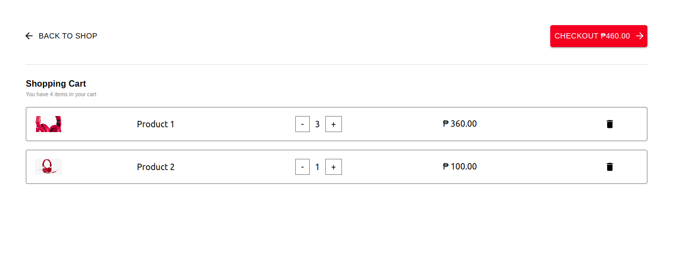

# ADD TO CART Mini-app



## Changelogs

```sh
- v0.3.1 - empty cart added
- v0.2.1 - Adding props
- v0.1.1 - Adding redux
- v0.0.1 - Adding cart and card components
```

## Installation

```sh
npm i addtocart-mini-app
```

## react 18 higher
```sh
npm i addtocart-mini-app --legacy-peer-deps
```

## Usage


```sh

import {Cart } from "addtocart-mini-app"
const dataLoad = {
  data:[
    {
      id: 1,
      title: "Product 1",
      description: "Best headphone",
      price: 120.00,
      quantity: 3,
      dataAdded: "Fri Oct 28 2022 12:33:52 GMT+0800 (Philippine Standard Time)",
      image: "https://i.pinimg.com/originals/0d/86/b1/0d86b14bb6503907498ebff62062ae12.png"
  },
  {
      id: 2,
      dateAdded: "Fri Oct 28 2022 12:33:01 GMT+0800 (Philippine Standard Time)",
      title: "Product 2",
      description: "Best headphone 2",
      price: 100.00,
      quantity: 1,
      image: "https://www.nicepng.com/png/detail/151-1512944_red-headphone-png-image-background-beats-by-dr.png"
  }
  ]
}
const dataIn = {
    action:{
      shoplink: () => alert("go to shop"),
      decreaseQty: (i:any) => alert(`decrease quantity of item with the id of ${i}` ),
      increaseQty: (i:any) => alert(`increase quantity of item with the id of ${i}` ),
      removeItems: (i:any) => alert(`remove this item with the id of ${i}`)
    }
}
function App() {
  return (
    <div className="">
      <Cart dataLoad={dataLoad} dataIn={dataIn} data={(i) => console.log(i)}/>
    </div>
  );
}

export default App;

```

## Props Types
```sh
dataOut: (i:any) => void,
dataLoad: {
  data?: { [key: string]: any }[];
}
dataIn: {
  action?: {
    shoplink: () => void,
    decreaseQty: (i:any) => void,
    increaseQty: (i:any) => void,
    removeItems: (i:any) => void 
  }
}  

```

## Node Version

```sh
v16.15.0
```

## Peer Dependecies

```sh
"react": "^17.0.2",
"react-dom": "^17.0.2"
```
